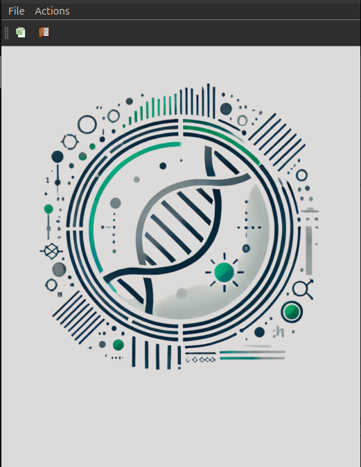
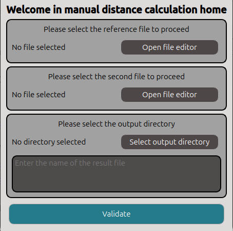
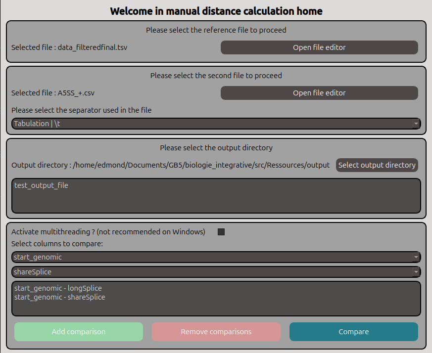
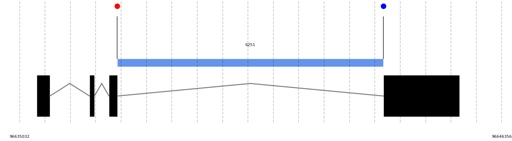

## Documentation

This part will be dedicated to explain how to use the software.

- Home view

When you start the program, a window like this will open. From this window you can load datasets from the menu `File`, or from the table icon. If you don't want to load a datasets directly, you can click on the `Actions` menu to get access to the features.

- Convert NCBI transcript IDs into Ensembl IDs

This feature is destined to convert NCBI transcript identifiers into Ensembl identifiers. To do that, you have to load the dataset with the identifiers inside the `refseq`column. If there is no `refseq`column, the software will throw an error. Note that the conversion give only one Ensembl equivalent identifiers, if you want a precise equivalent, you will have to change it yourself.

- Filter Rmats

Inside the `Actions` menu, you can click on the `Filter Rmats`submenu. It will ask you the location of the directory where Rmats files are stored. Please, as normal Rmats output, DO NOT change the default CSV separator (\t), else the program will throw an error. An info box will warn you when the conversion will be finished (almost instantly)

- Compute Distances

This menu will trigger various sub-menus to let you choose what type of calculation you want to. You can choose between :

    1. A5SS alternative splicing sites
    2. A3SS alternative splicing sites
    3. RI alternative splicing sites
    4. MXE alternative splicing sites
    5. SE alternative splicing sites
    6. All types of alternative splicing sites
    7. Manual mode

After your choice, a window of this style will open:

You have a section to load the reference datasets. The calculations will be based on these coordinates (ref_coordinates - 2nd_coordinates). Also for the comparaison datasets. You can load excel and CSV files. Note that for CSV files, we will scan the file to set the separator characater. If it fails, please select yourself the character.

**Datasets have to respect some rules:**
- Reference dataset has to contain the `GeneID`column with Ensembl gene identifyers for the element and `ensembl_id` column which contains the Ensembl transcript identifyer.
- Comparison dataset has to contain the `GeneID`column with Ensembl gene identifyers for the element

After that you have to select an output directory ans an output file name. If nothing is given, the output files will be in the root prooject with just `dna`or `rna`prefix. If everythin is done, you can click and `Validate`.

Some elements will be added to the window. Now you can select the columns to compare with the combo boxes. If you have chosen a specific splicing type or all, the comparison coluns will be automaticaly added.

**Please note that you have to specify a column with __only__ numeric values. Remove strings or ambiguous values. Otherwise, you will have an error message.**

You can add all the combinaison you want, but not twice the same (Warning message if this case). If you have done a mistake, you can remove the last added combinaison with the red button. Finally you can launch the computation with the `Compare` button. A progress bar will be displayed to warn you about the calculation progress. A little moment can occured before the starting of calculation because of compilation of some functions. You can now check your results files !

**Note that the calculations can be parallelised by activating the multiprocessing. A spinbox will appeare to ask you how many processes you want. This is highly not recommended an the .exe version.**

- Localisation visualisation

This feature can be accesed through the CSV viewer of the project. If you have loaded a result distance file, you can select with left-click a transcript Ensembl ID and two coordinates. Once done, you can right-click and a menu will appear. You can decide to plot the configuration with the DNA distances or not.

__Example__:

