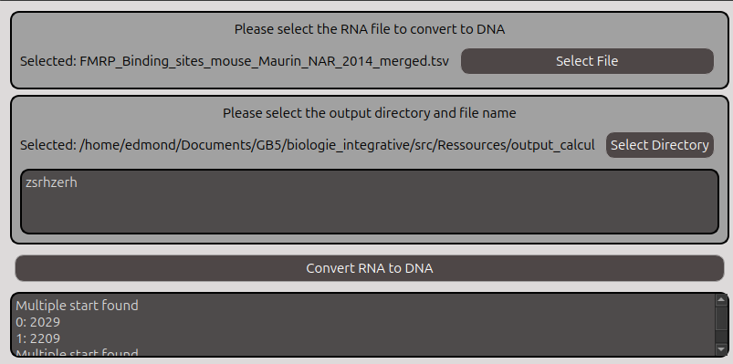

# RepostionX


RepositionX is a `python3` free and opensource software wich allow you to compute distances between two sites on RNA or DNA. RepositionX is a final student year project at Polytech Nice-Sophia bio-engineering school in partnership with the laboratory IPMC member of the CNRS.


[](https://www.python.org)


)
## Installation

```batch
    python --version
```
Or
```bash
    python3 --version
```
    

- Windows: 
There is a .exe file which launchs the project. But you can also use the .bat file which will install all the python dependencies and run the program.


- Linux:
The project contains an Anaconda environment file. You can install the virtual environement with the command :

```bash
  conda env create -f env.yml
```

And launch the project with :

```bash
  conda activate <env_name>
  python3 main.py
```

- Docker:
A docker file is also furnished with the project. Linux users can directly build the image with :

```bash
docker build -t <your-username>/RepositionX dockerfile
docker image ls
```

After the building you can run the docker with:

```bash
bash boot_docker.sh
```

Note that if you want to retrieve the ouput file of the program, you will have to mount your output repository inside the docker. See the commented line inside boot_docker.sh.


    
## Features

- Cross platform
- Convert NCBI transcript IDs into Ensembl IDs
- Download and load specific GTF files from Ensembl
- Convert mRNA coordinates into DNA coordinates
- Filter and restructure Rmat ouput files
- Compute DNA distances and mRNA distances
- Visualise protein fixation sites on raw RNA


## Documentation

This part will be dedicated to explain how to use the software.

- Home view


When you start the program, a window like this will open. From this window you can load datasets from the menu `File`, or from the table icon. 
If you choose this way to load files, you have to know the order and name of the columns, as the automated detector will classify it as a "compared file" if the first column is "GeneID", and as a "reference file" otherwise. 

You may bypass this by clicking on the `Actions` menu to open a window where you can upload your files however you choose. 

Another button `load ooutput` allows you to specifically load .csv files to view them directly in the software.

Note that you may load only one file for those 3 categories.

- Convert NCBI transcript IDs into Ensembl IDs

This feature is destined to convert NCBI transcript identifiers into Ensembl identifiers. To do that, you have to load the dataset with the identifiers inside the `refseq`column. If there is no `refseq`column, the software will throw an error. Note that the conversion gives only one Ensembl equivalent identifier, if you want a precise equivalent, you will have to change it yourself.

- Parsing Rmats

Inside the `Actions` menu, you can click on the `Parsing Rmats`submenu. It will ask you the location of the directory where the Rmats files are stored. **Beware that the programm doesn't support any other separator than (\t) for this particular function and will crash**. An information window will tell you when the conversion is finished (almost instantly)

- Convert mRNA to DNA

Inside the `Actions` menu, you can click on the `Convert mRNA to DNA` submenu. You will have this type of window:



So, the software will ask you the path to the datasets which contains the coordinates to translate into DNA ones and the path for the output datasets. Note that your dataset must repsect some constraints:

 - "ensembl_id" column containing the ensemble transcript ID of the event
 - "seq" column for the fixation sequence on RNA if you have it
 - "start" for the 1st coordinate on the mRNA
 - "end" for the 2nd coordinates on the mRNA

Note that the software will ask you if you need the fixation sequence. If you don't and directly have the mRNA coordinates, please select the option. If you only have the fixation sequence on the mRNA, don't choose this option. The program will align the sequence to get itself the start and end coordinates.


- Compute Distances

This menu will trigger various sub-menus to let you choose what type of calculation you want to. You can choose between :

    1. A5SS alternative splicing sites
    2. A3SS alternative splicing sites
    3. RI alternative splicing sites
    4. MXE alternative splicing sites
    5. SE alternative splicing sites
    6. All types of alternative splicing sites
    7. Manual mode

After your choice, a window of the following appearance will open:


You have a section to load the reference dataset. The calculations will be based on these coordinates (ref_coordinates - 2nd_coordinates). You can load excel and CSV files. Note that for CSV files, we will scan the file to set the separator characater. If it fails, please select yourself the character.

**Datasets have to respect some rules:**
- Reference dataset has to contain the `GeneID`column with Ensembl gene identifyers for the element and `ensembl_id` column which contains the Ensembl transcript identifyer.
- Comparison dataset has to contain the `GeneID`column with Ensembl gene identifyers for the element


After that, you have to select an output directory and an output file name. If nothing is given, the output file will be in the root prooject with just `dna`or `rna` prefix. If everything is done, you can click and `Validate`.


Some elements will be added to the window. Now you can select the columns to compare with the combo boxes. If you have chosen a specific splicing type or all, the comparison colunms will be automaticaly added.

**Please note that you have to specify a column with __only__ numeric values. Remove strings or ambiguous values. Otherwise, you will have an error message.**

You can add all the combinaison you want, but not twice the same (Warning message if this case). If you have done a mistake, you can remove the last combinaison with the `remove comparison` button in red. Finally you can launch the computation with the `Compare` button. A progress bar will be displayed to inform you about the calculation progress. A little moment can occured before the starting of calculation because of compilation of some functions. You can now check your results files !

**Note that the calculations can be parallelised by activating the multiprocessing. A spinbox will appear to ask you how many processes you want. This is highly ill-advised on the .exe version.**


- Localisation visualisation

This feature can be accessed through the CSV viewer of the project. If you have loaded a result distance file, you can select with left-click a transcript Ensembl ID and two coordinates. You can then right-click and a menu will appear. You can decide to plot the configuration with the DNA distances or not.

__Example__:


## Authors

**First authors**
- [@Berne Edmond](https://github.com/Edmondbrn)
- [@Martin François](https://www.github.com/octokatherine)

**Other author**
- [@Rouget Simon](https://www.github.com/octokatherine)


