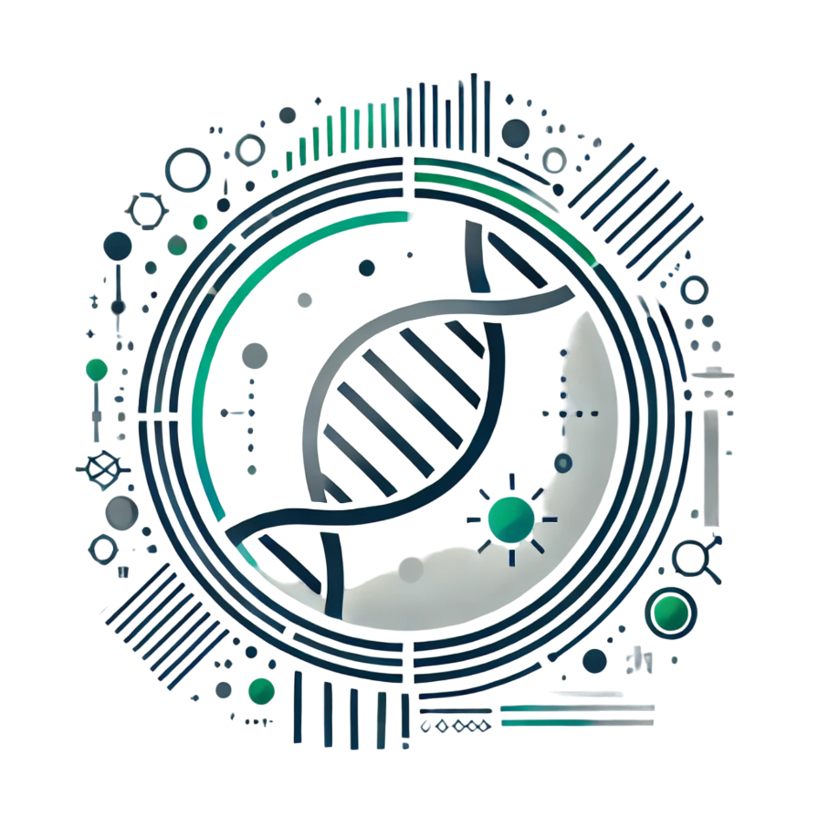

# RepostionX
<div style="display: flex; align-items: center; flex-direction: row;">
  <div style="flex: 1;">
    RepositionX is a `python3` free and opensource software which allows you to compute distances between two sites on RNA or DNA. RepositionX is a final student year project at Polytech Nice-Sophia bio-engineering school in partnership with the laboratory IPMC member of the CNRS.
  </div>
  <div style="flex: 2;">
    
  </div>
</div>


[](https://www.python.org)


)
## Installation

The project is compatible with Windows and Debian Linux. Please be sure that python3.10 is installed on your machine and check if python is added to your OS PATH with :

```batch
    python --version
```
Or
```bash
    python3 --version
```
    

- Windows: 
There is a .exe file which launch the project. But you can also use the .bat file which will install all the python dependencies and run the program.


- Linux:
The project contains a Anaconda environment file. You can install the virtual environement with th command :

```bash
  conda env create -f env.yml
```

And launch the project with :

```bash
  conda activate <env_name>
  python3 main.py
```

- Docker:
A docker file is also furnished with the project. Linux users can directly build the image with :

```bash
docker build -t <your-username>/RepositionX dockerfile
docker image ls
```

After the building you can run the docker with:

```bash
bash boot_docker.sh
```

Note that if you want to get back the ouput file of the program, you wille have to mount your output repository inside the docker. See the commented line inside boot_docker.


    
## Authors

**First author**
- [@Berne Edmond](https://github.com/Edmondbrn)

**Other authors**
- [@Martin François](https://www.github.com/octokatherine)
- [@Rouget Simon](https://www.github.com/octokatherine)


## Features

- Cross platform
- Convert NCBI transcript IDs into Ensembl IDs
- Convert mRNA coordinates into DNA coordinates
- Filter and restructure Rmats ouput files
- Compute DNA distances and mRNA distances
- Visualise protein fixation sites ont raw RNA


## Documentation

This part will be dedicated to explain how to use the software.

- Home view


